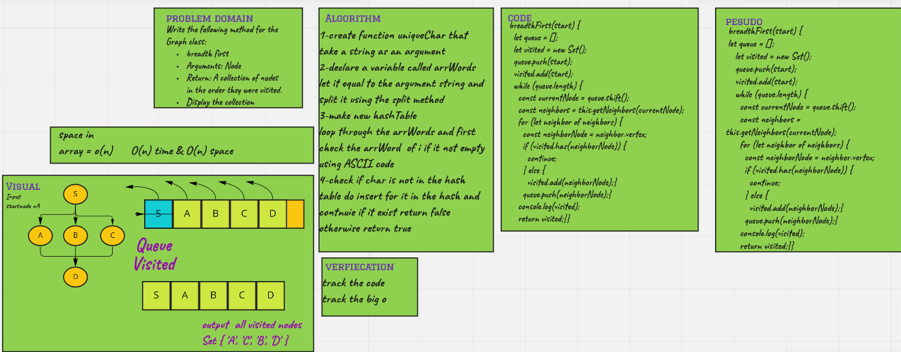

# Challenge Summary

Write the following method for the Graph class:

   * breadth first
   * Arguments: Node
   * Return: A collection of nodes in the order they were visited.
   * Display the collection

## Whiteboard Process

## Approach & Efficiency

time O(n) and space o(n) 

because I used the for of and I declared two new array and set map

## Solution

 npm test breadthFirst.test.js

