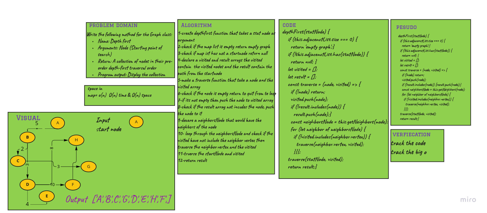

# Challenge Summary

Write the following method for the Graph class:

   * Name: Depth first
   * Arguments: Node (Starting point of search)
   * Return: A collection of nodes in their pre-order depth-first traversal order
   * Program output: Display the collection

## Whiteboard Process

## Approach & Efficiency

time O(n) and space o(n) 

because I used the for of and I declared two new arrays

## Solution

> npm test graph.test.js