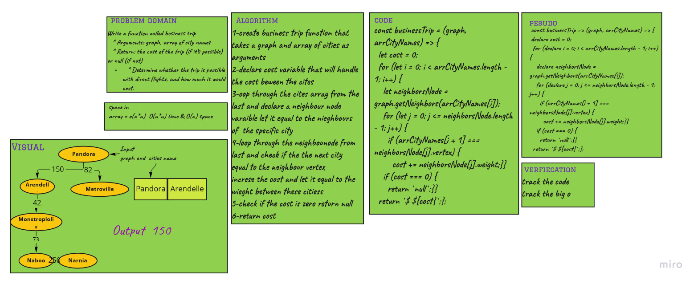

# Challenge Summary

Write a function called business trip
   * Arguments: graph, array of city names
   * Return: the cost of the trip (if it’s possible) or null (if not)
   * Determine whether the trip is possible with direct flights, and how much it would cost.

## Whiteboard Process

## Approach & Efficiency

time O(n*n) and space o(n) 

because I used the 2 for of and I declared two new variables

## Solution

npm test graph-business-trip.test.js