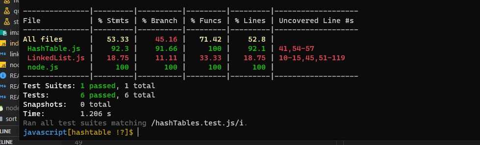

# Hashtables

A hashtable is a data structure used to store data as key/value pairs.

A hashtable is traditionally created from an array. Each Index of the array is known as a bucket; since it can store multiple key/value pairs. To cover the case of collisions, buckets can be linked lists, arrays, or any other data structure.

The hashtable uses a hashing algorithm that encodes the key to map the value to a specific bucket in the array. In other words, the hash generates the index of the array’s bucket in which the value is stored.

## Challenge and API

Implement a Hashtable Class with the following methods:

* set
    * That have arguments: key, value
    * And it returns: nothing
    * This method should hash the key, and set the key and value pair in the table, handling collisions as needed.
    * Should a given key already exist, replace its value from the value argument given to this method.
* get
    * Arguments: key
    * Returns: Value associated with that key in the table
* contains
    * Arguments: key
    * Returns: Boolean, indicating if the key exists in the table already.
* keys
    * Returns: Collection of keys
* hash
    * Arguments: key
    * Returns: Index in the collection for that key

## Approach & Efficiency

n is the hash table size m is the bucket size, can be 1 if no collisions occurred

| Method | Time complixity | Space  |
| ------ | --------------  | -----  |
| Hash   | O(1)      | O(1) |
| Set | O(1) | O(n)  |
| get | O(m) | o(1)  |
| contain | o(m) | o(1)  |

# Test 

