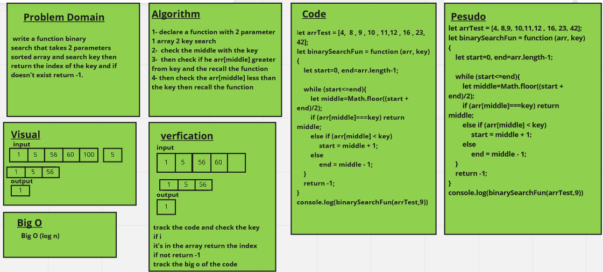

# Binary Search of Sorted Array

 write a function binary
search that takes 2 parameters sorted array and search key then return the index of the key and if doesn't exist return -1. 

## Whiteboard Process

## Approach & Efficiency

I used the recurion to solve the challange and the big O is O(log n)
