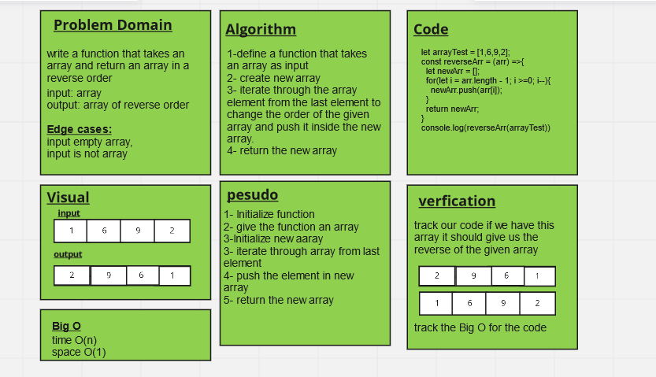

# Reverse an Array

write a function that takes an array and return an array in a reverse order

## Whiteboard Process

## Approach & Efficiency

I used for one loop to decrease the time and space complexity and this will increase the Efficiency.