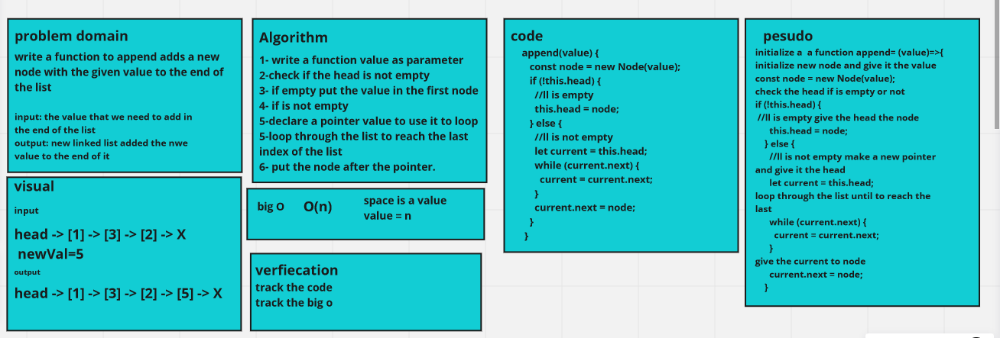
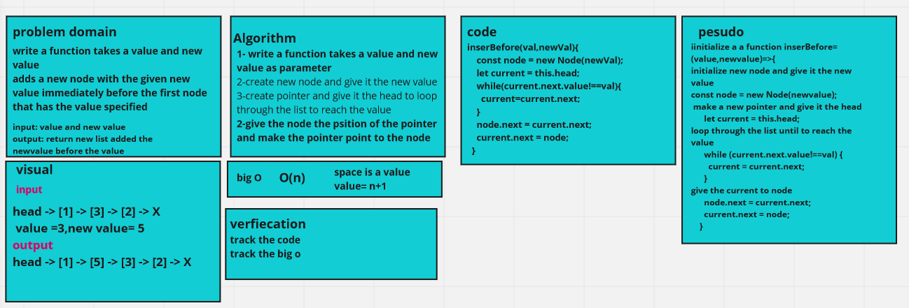
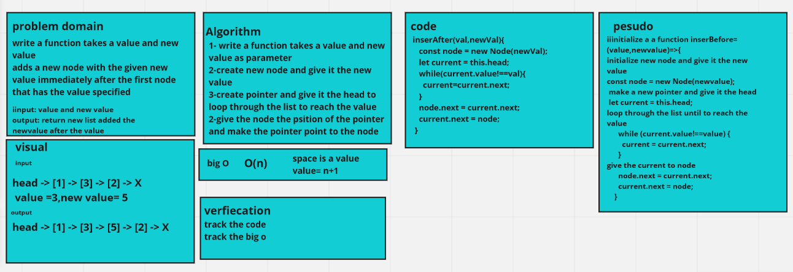

# Challenge Summary

challeng #6

write the following methods for the Linked List class: append, insertefore and inserAfter.

## Whiteboard Process

### append method

### insertBefore method

### insertAfter method

## Approach & Efficiency
<!-- What approach did you take? Why? What is the Big O space/time for this approach? -->
its o(n) because i used the while loop in all the three methods

## Solution

To run the code use

npm test linked-list.test.js