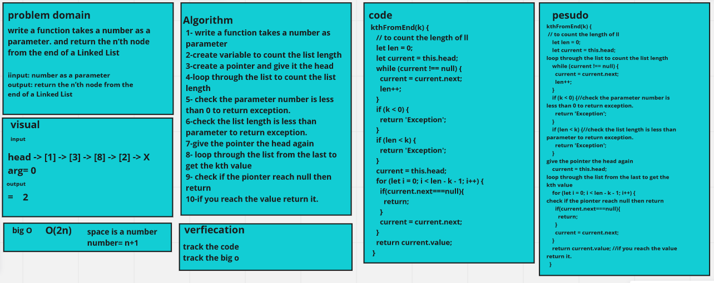

# Challenge Summary

Program for n’th node from the end of a Linked List

## Whiteboard Process

## Approach & Efficiency

Time Complexity: O(2n) because I used 2 while loop to check the kth number. 

## Solution

To run the code use

npm test linked-list.test.js

