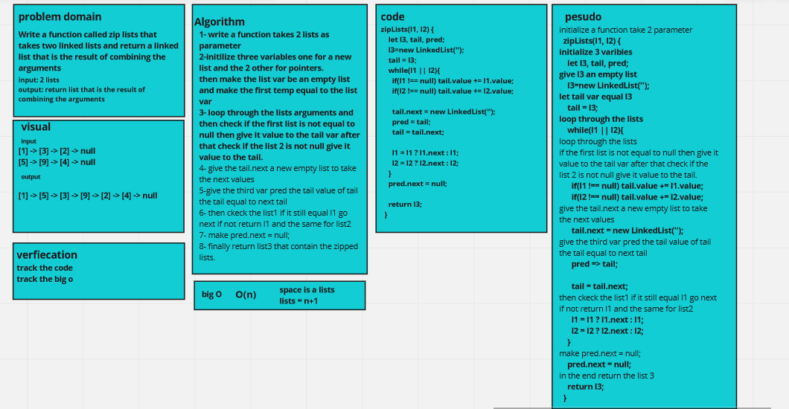

# Challenge Summary

challeng #8

Write a function called zip lists that takes two linked lists and return a linked list that is the result of combining the arguments

## Whiteboard Process

### 

## Approach & Efficiency
<!-- What approach did you take? Why? What is the Big O space/time for this approach? -->
its o(n) because i used the while loop in the ziplists method

## Solution

To run the code use

npm test linked-list.test.js