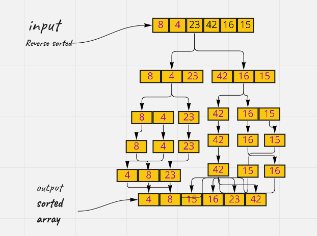
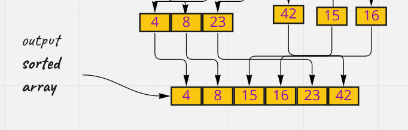

# MergeSort


**Merge Sort** is a divide and conquer algorithm

Divide the list recursively into two halves until it can no more be divided. Then **merge** the smaller lists into new list in sorted order.


Pseudo Code

```
ALGORITHM Mergesort(arr)
    DECLARE n <-- arr.length

    if n > 1
      DECLARE mid <-- n/2
      DECLARE left <-- arr[0...mid]
      DECLARE right <-- arr[mid...n]
      // sort the left side
      Mergesort(left)
      // sort the right side
      Mergesort(right)
      // merge the sorted left and right sides together
      Merge(left, right, arr)

ALGORITHM Merge(left, right, arr)
    DECLARE i <-- 0
    DECLARE j <-- 0
    DECLARE k <-- 0

    while i < left.length && j < right.length
        if left[i] <= right[j]
            arr[k] <-- left[i]
            i <-- i + 1
        else
            arr[k] <-- right[j]
            j <-- j + 1

        k <-- k + 1

    if i = left.length
       set remaining entries in arr to remaining values in right
    else
       set remaining entries in arr to remaining values in left

```


## Example:

Trace

Sample Array: [8,4,23,42,16,15]

Pass 1:

The first function will divde the array into equals two halves then divide the array recursively into two halves until it can no more be divided.

like the picture below 




pass 2:

the secound function we loop through the halves and check each element in the two halves which is smaller and sorted the array and return a new sorted array.




## Efficency

Time: O(nlogn)

Overall time complexity of Merge sort is O(nLogn). It is more efficient as it is in worst case also the runtime is 
O(nlogn)

Space: The space complexity of Merge sort is O(n). This algorithm takes a lot of space.

