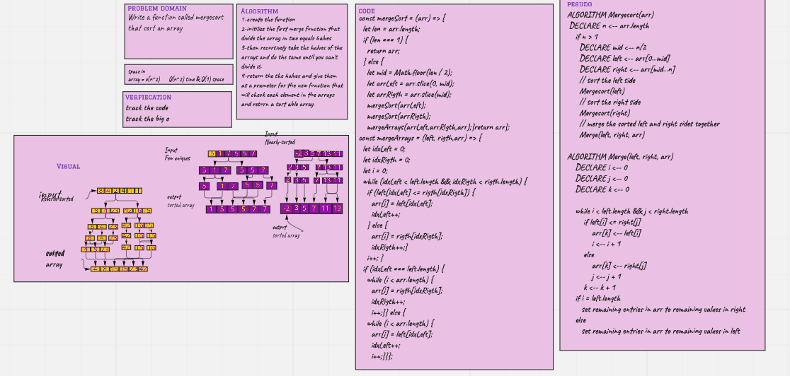

# Challenge Summary

merge Sort

Merge Sort is a divide and conquer algorithm

Divide the list recursively into two halves until it can no more be divided.

write a mergeSort function that sort an array.

## Whiteboard Process

## Approach & Efficiency

Overall time complexity of Merge sort is O(nLogn). It is more efficient as it is in worst case also the runtime is 
O(nlogn)

The space complexity of Merge sort is O(n). This algorithm takes a lot of space.

## Solution

 npm test mergeSort.test.js