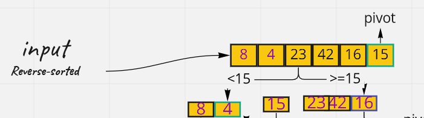
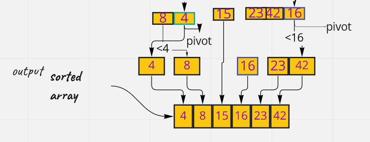

# Quick Sort

Quick sort follows Divide and Conquer algorithm


It is dividing elements in to smaller parts based on some condition and performing the sort operations on those divided smaller parts. It works well for large datasets.


### Pseudo Code

```
ALGORITHM QuickSort(arr, left, right)
    if left < right
        // Partition the array by setting the position of the pivot value
        DEFINE position <-- Partition(arr, left, right)
        // Sort the left
        QuickSort(arr, left, position - 1)
        // Sort the right
        QuickSort(arr, position + 1, right)

ALGORITHM Partition(arr, left, right)
    // set a pivot value as a point of reference
    DEFINE pivot <-- arr[right]
    // create a variable to track the largest index of numbers lower than the defined pivot
    DEFINE low <-- left - 1
    for i <- left to right do
        if arr[i] <= pivot
            low++
            Swap(arr, i, low)

     // place the value of the pivot location in the middle.
     // all numbers smaller than the pivot are on the left, larger on the right.
     Swap(arr, right, low + 1)
    // return the pivot index point
     return low + 1

ALGORITHM Swap(arr, i, low)
    DEFINE temp;
    temp <-- arr[i]
    arr[i] <-- arr[low]
    arr[low] <-- temp

```

## Trace

**Sample array:** [ 8, 4, 23, 42, 16, 15 ]

**Expected result:** [ 4, 8, 15, 16, 23, 42 ]


The steps how Quick sort works:

**Pass #1:**

Determine pivot element. So, 15 is the pivot element.




**pass#2**

* Sort the elements of the array (the partitioning function):

    * Elements to the left of the pivot are smaller than the pivot
    * Elements to the right are greater than the pivot This process is called
    * if an element is equal to the pivot, it will go to the left

* Repeat the process for the left and right side of the pivot, until the array is sorted.




## **Efficiency**


* Big O of space: O(1)

* Big O of time: O(n log n) in the best case, O(n log n) in the average case, and O(n^2) in the worst case.
