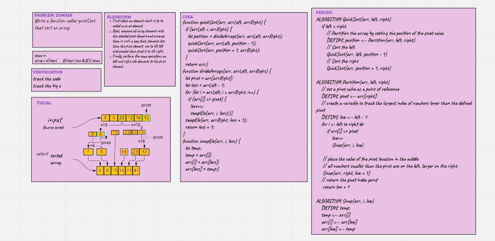

# Challenge Summary

Quick Sort

write a quickSort function that sort an array.

## Whiteboard Process

## Approach & Efficiency

Quick sort runs with the Time Complexity of O(nlogn).

The space complexity of quick sort is: space: O(1)

## Solution

npm test quickSort.test.js

