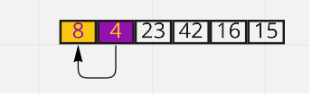
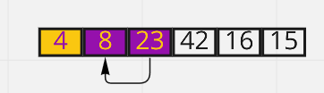
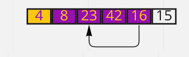
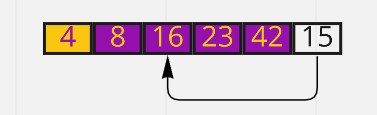
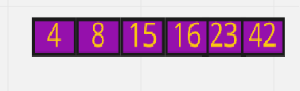

#  Insertion Sort Algorithm

Insertion sort algorithm is a basic sorting algorithm that sequentially sorts each item in the final sorted array or list.

Insertion sort => 
* insertion sort is efficient for array with small datasets.
* insertion sort require a constant amount of extra memory.
* can sort a single element at time.
* has worst complixity of O(n^2).


## Pseudocode

```
  InsertionSort(int[] arr)

    FOR i = 1 to arr.length

      int j <-- i - 1
      int temp <-- arr[i]

      WHILE j >= 0 AND temp < arr[j]
        arr[j + 1] <-- arr[j]
        j <-- j - 1

      arr[j + 1] <-- temp

```

## Example:

Trace

Sample Array: [8,4,23,42,16,15]

Pass 1:

we start from traverse the array from arr[1] to arr[n-1]



> if the data is smaller than the predecessor then we will compare it with the element before that.

pass 2:

the element at the index 1 will be compared to the only element to its left, which is the element at index 0:

if the element at index 1 was less than the element at index 0; the two will swap, if not, nothing will happen





pass 3:

the element at the index 2 will be compared to the elements at index 1 and 0.




pass 4:

We will shift bigger element on index up to make space for swapped element.





pass 5:

we reach to the final sorted array



On its final iteration through the array,the element at the index 5 will be compared to the elements at the indices 4, 3, 2, 1 and 0, the same way it was happening at the previous passes.

## Efficency

Time: O(n^2)
        The basic operation of this algorithm is comparison. This will happen n * (n-1) number of times…concluding the algorithm to be n squared.

Space: O(1)
        No additional space is being created. This array is being sorted in place…keeping the space at constant O(1).
