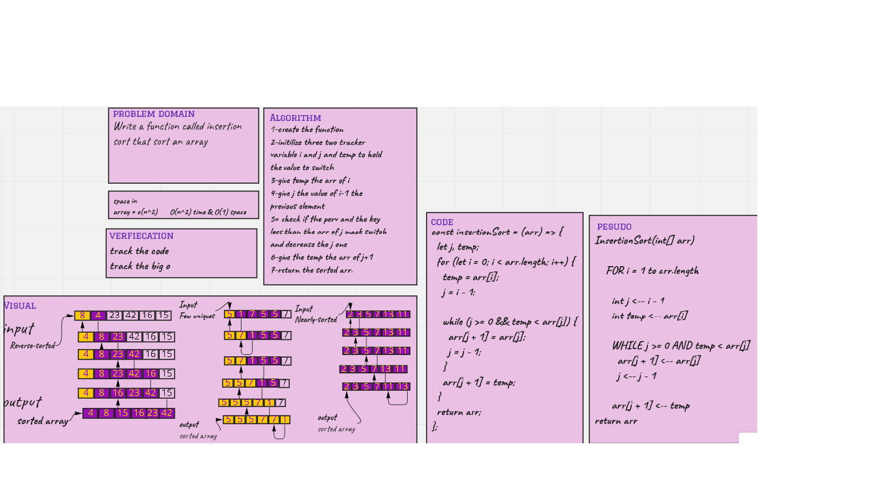

# Challenge Summary

Insertion sort => 
* insertion sort is efficient for array with small datasets.
* insertion sort require a constant amount of extra memory.
* can sort a single element at time.
* has worst complixity of O(n^2).

## Whiteboard Process

## Approach & Efficiency

O(n^2) because I used 2 loops and space is o(1);

## Solution

 npm test insertionSort.test.js

