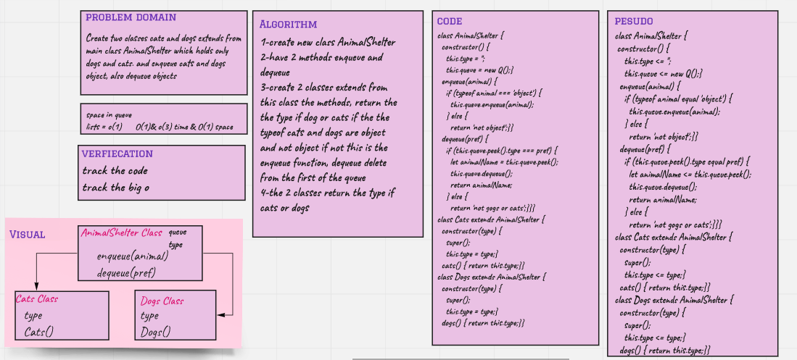

# Challenge Summary

## AnimalShelter challnege #12

Create two classes cats and dogs extends from main class AnimalShelter which holds only dogs and cats. and enqueue cats and dogs object, also dequeue objects 

## Whiteboard Process

## Approach & Efficiency

the Big O(1) for enqueue because we insert a value but for the dequeue is a O(3) because we deleting from the first of queue.

## Solution

npm test AnimalShelter.test.js