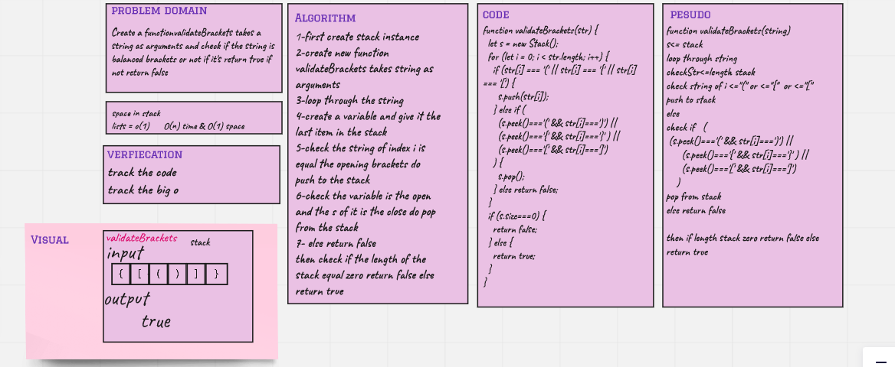

# Challenge Summary

## PesudoQueue challnege #13

Create a functionvalidateBrackets takes a string as arguments and check if the string is balanced brackets or not if it's return true if not return false

## Whiteboard Process

## Approach & Efficiency

the Big O(n) for function validateBrackets because I used for loop O(1) space because I push to stack then pop

## Solution

npm test stack-queue-brackets.test.js
