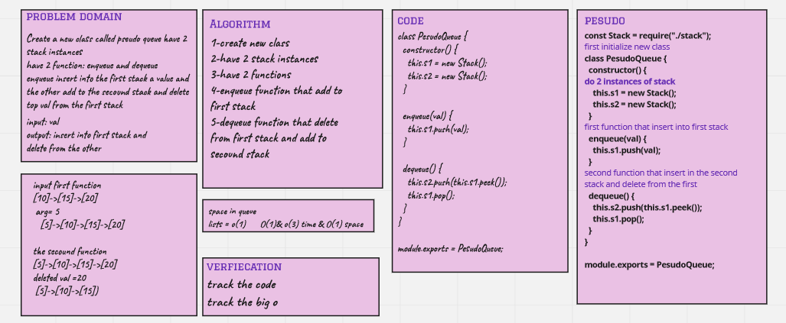

# Challenge Summary

## PesudoQueue challnege #11

Create a new class called pseudo queue have 2 stack instances 
have 2 function: enqueue and dequeue
enqueue insert into the first stack a value and the other add to the secound stack and delete top val from the first stack

## Whiteboard Process

## Approach & Efficiency

the Big O(1) for enqueue because we insert a value but for the dequeue is a O(3) because we insert in the s2 then we pop from s1

## Solution

npm test stack-queue-pesudo.test.js

