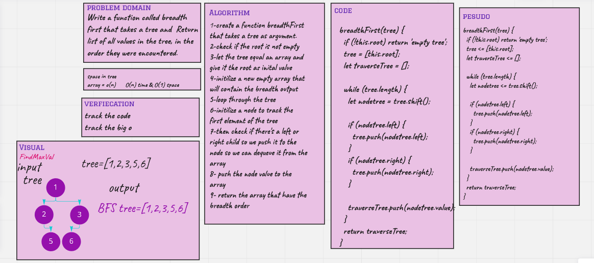

# Challenge Summary

Write a function called breadth first that takes a tree and  Return list of all values in the tree, in the order they were encountered.

## Whiteboard Process

## Approach & Efficiency

O(n) and o(1) space

## Solution

npm test binaryTrees.test.js

