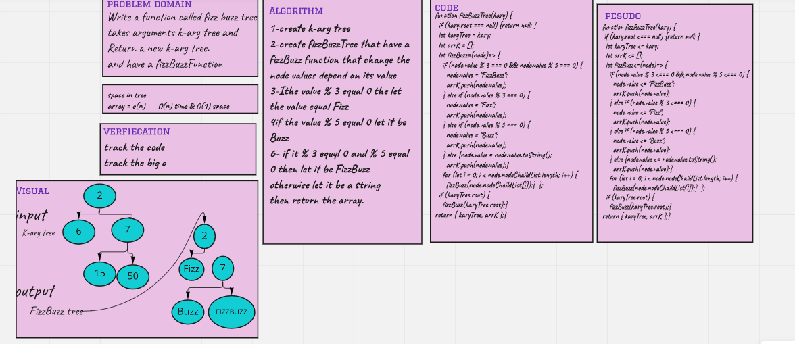

# Challenge Summary

Write a function called fizz buzz tree
takes arguments k-ary tree and Return a new k-ary tree.
and have a fizzBuzzFunction

## Whiteboard Process

## Approach & Efficiency

O(n) because I used if statment and o(1) space

## Solution

npm test Kary.test.js
