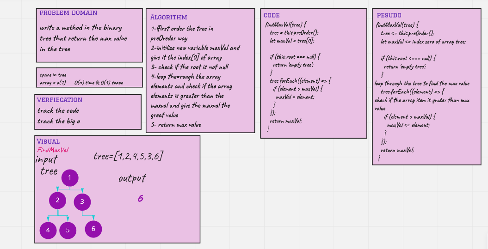

# Challenge Summary

Write a method in the binary tree that return the max value in the tree

## Whiteboard Process

## Approach & Efficiency

o(n) because I iterate through the array to find the value
and space is 0(1) because I didn't create a new array to be a tree I used the same tree I initilized in the test

## Solution

 npm test binaryTrees.test.js
