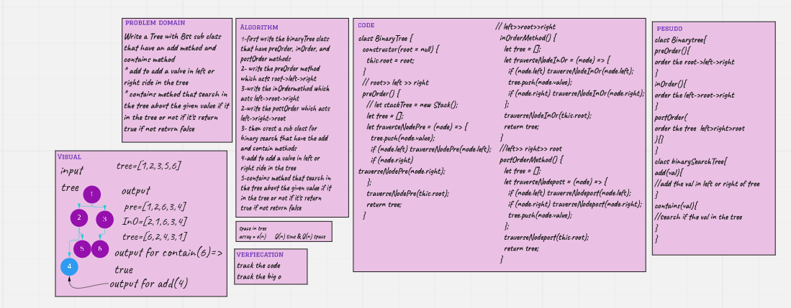

# Challenge Summary

Write a Tree with Bst sub class that have an add method and contains method
* add to add a value in left or right side in the tree
* contains method that search in the tree about the given value if it in the tree or not if it's return true if not return false

## Whiteboard Process

## Approach & Efficiency

o(n) time and o(n) space

## Solution

 npm test BST.test.js